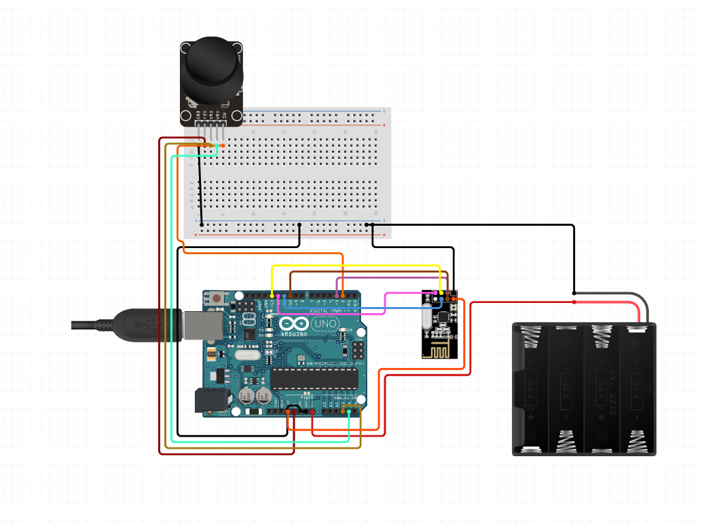
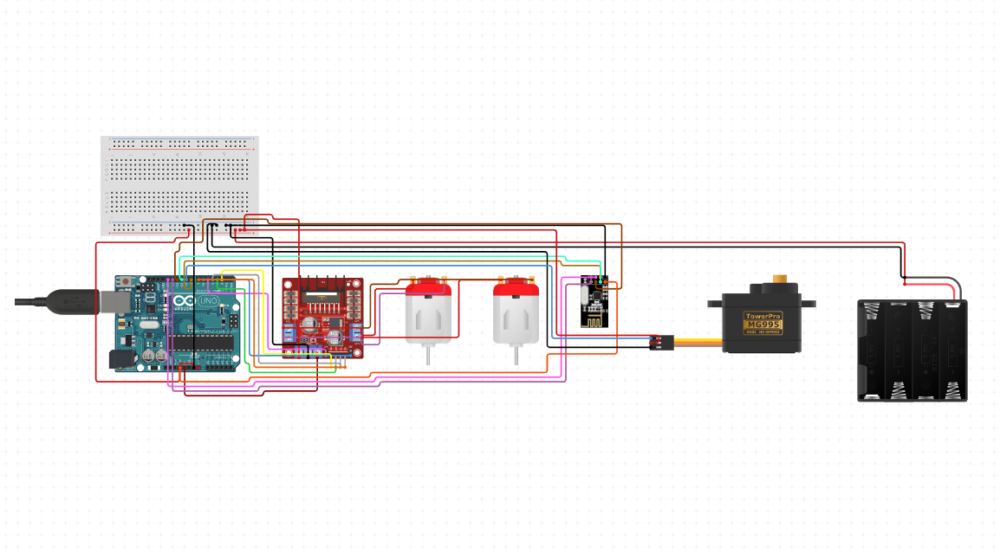
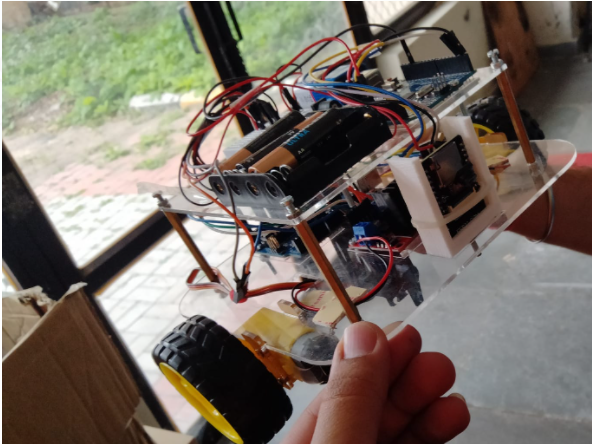
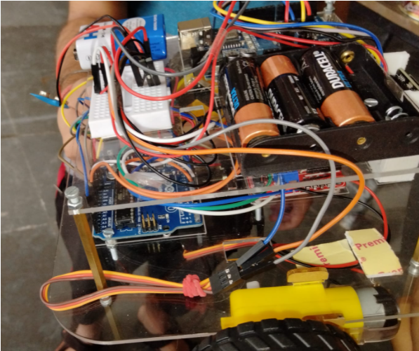
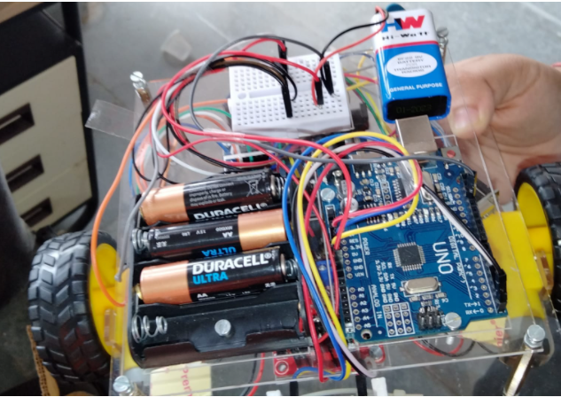

SPHERICAL SURVEILLANCE BOT

# SPHERICAL SURVEILLANCE BOT
Spherical bots are great way of surveillance due to their better mobility compared to other bots due to its rolling motion. They are highly beneficial for military purposes as they can provide live video feed of the surrounding land(where it is dangerous to enter) to the military base from which it is controlled through remote communication. It can further provide audio feed and help in mapping its location so that the controlling unit will be able to locate it whenever required(in case of any casualty or so). Spherical bots have advantage over aerial bots economically and are better to use for small-scale surveillance. Also they can be given the "disguise" attribute or "camouflage" by using special fluids.

---
## Current scope of the bot:
- Remote controlled Locomotion(by joystick)
- Live video stream capturing the surroundings in which the bot moves  

---
## Locomotion:
As mentioned earlier, the bot can be moved around with remote-control using a joystick. This is done to make the bot move around to get the video feed.

### Components required:
- Two axis joystick module
- Arduino Uno(x2)
- nRF24l01 module(without antenna)(x2)
- jumper wires (female-female, male-female, male-male)
- L298N motor driver module
- DC BO motors(x2)
- wheels (x2)
- Servo motor
- Weights
- 6V battery

### Implementation:
There are two units in Locomotion part:
- Control Unit
- Motion Unit
#### Control Unit:
The aim of this unit is to take input from the joystick in the form of an array which contains the input for both DC motors and servo motor(since it is a two axis joystick).
So first let us understand the dynamics associated with the bot(till our current work):
The entire Locomotion unit circuit is placed in the interior of the transparent sphere and is held steady by acrylic sheets. To both the ends of the locomotion unit circuit are connected two DC motors which are further mated(revolute mate) with the wheels. The wheels are attached to the sphere using a double-sided tape. So, even if the motors are provided with power and wheels are rotated, the  internal circuit remains stationary and the sphere that is attached to the wheels alone rotates with the wheels.
One of the axis of the joystick takes the readings for the speed of both the motors which means both the wheels move with the same speed.
Then how will the bot tilt to the right or left or take a turn?
This is accomplished with the help of servo motor which is connected to weights. If the servo motor is turned in such a way that the weights tilt to the right or to the left, then the center of mass of the bot changes accordingly which changes the orientation of the bot. With the help of this, we will be able to turn the bot to the right or left. So, the another axis of the joystick is gives the angle which the servo motor should move.
For example, if u move the joystick along its x-axis, both dc motors move depending on the angle through which the joystick was turned. If the axis is not turned at all, the motors won't rotate or even tend to rotate(since there will be a minimum power requirement for the motors to work). If u move the joystick to the positive end, the motors move forward and if u move it to the negative end, they rotate in the reverse direction with their speed depending on the position of the joystick. Now the rate at which the speed of the motors changes depends on the rate at which u change the position of the stick.

Now, the position of the stick relative to the other axis gives the angle of the servo which will be its input. If the stick is not moved wrt y axis, the servo motor shaft will assume its initial position(90 degrees). If the stick is moved to one extreme of the axis, the position will be 0 degrees and for the other extreme, it'll be 180 degrees.

If the joystick position is 45 degrees wrt both the axes in then positive sense, the bot would turn to the right and so on...

The next is the circuit part:
The data from the joystick(input on both the joystick axes) is sent to the Arduino Uno in the Control unit. Uno transmits this data in the form of an array through the nRF24l01 module at the control unit which acts as the transmitter(TX) for the entire "Locomotion Part". The data from the joystick is sent to the Arduino Uno in the 'Control unit' through SPI communication which is a wired protocol to transmit data synchronously between a "Master" and a "slave" which in this case are "Uno" and "nRF24lo1" respectively. 

Here's the circuit for the Control Unit of the Locomotion Part:



#### Motion unit:
The data sent by the TX is received by another such nRF24l01 module present inside the bot which acts as RX for our "Locomotion Part". This data is then sent to the Arduino Uno in the bot(again SPI protocol) which then sends the actuating signals to the motor and the servo that allow the locomotion. 

Here's the circuit for the Motion Unit of the Locomotion Part:


---
The following is the code Control Unit of the locomotion part
```
#include <RF24.h>
//this library is to ensure proper functioning of the nRF module
#include <RF24Network.h>
//Libraries should be imported so that nRF communication is possible between the "Control" and the "Motion" units

#include <SPI.h>
//Library to allow SPI protocol between "Master" and "Slave" in both the units of the Locomotion part

#define Xpin A3 //analog pin to read the joystick value for the motor movement
#define Ypin A4 //analog pin to read the joystick value for the servo control

uint8_t joystick[2]; //variable to store the signal which is to be transmitted to the Locomotion unit

int Xval,Yval;
int dt = 500;

RF24 radio(3, 10);               // nRF24L01 (CE,CSN)
//Here CE is chip enable pin which enables the functioning of the circuit that makes the module. CSN stands for chip select not pin which is responsible for selecting the receiver in the wireless communication 
RF24Network network(radio);      // Include the radio in the network
const uint16_t this_node = 00;   // Address of this node in Octal format ( 04,031, etc)
const uint16_t node01 = 01;   //Adress of the receiver node

void setup() {
  SPI.begin();//beginning of the SPI communication 
  Serial.begin(9600);
  radio.begin(); 
  network.begin(90, this_node);  //(channel, node address)
  
  pinMode(Xpin,INPUT);
  pinMode(Ypin,INPUT);
  
}

void loop() {
  
  joystick[0] = map(analogRead(Xpin), 0, 1023, 0, 255);
  joystick[1] = map(analogRead(Ypin), 0, 1023, 0, 180);
  //reading the joystick values on both the axes and map them in necessary format and put them in an array

  Serial.println("------------------------");
  Serial.print("Motor Value : ");
  Serial.println(joystick[0]);
  Serial.print("Servo Value : ");
  Serial.println(joystick[1]);

  network.update();
  //updating the network between the two nodes so as to update new values on the network
  
  RF24NetworkHeader header(node01);     // (Address where the data is going)
  bool ok = network.write(header, &joystick, sizeof(joystick)); // Send the data
  
  delay(500);
  
}
```
---
Here is the code for the Motion unit of the Locomotion part:
```
#include <RF24.h>
#include <RF24Network.h>
#include <SPI.h>
#include <Servo.h> 
//importing the servo library

#define EN12 5
#define EN34 6
//enable pins on the L298N motor driver

#define IN1 2
#define IN2 3
#define IN3 4
#define IN4 7
//input pins which hold the directional data on the motor driver

#define servoPin 9
//holds the value of the directional out

RF24 radio(8, 10);               // nRF24L01 (CE,CSN)
RF24Network network(radio);      // Include the radio in the network
const uint16_t this_node = 01;   // Address of our node in Octal format ( 04,031, etc)
Servo myservo;  // create servo object to control a servo
int servoVal;
int motorVal;

uint8_t buf[2];


void setup() {
  Serial.begin(9600);
  SPI.begin();
  radio.begin();
  network.begin(90, this_node); //(channel, node address)
  
  pinMode(EN12, OUTPUT);
  pinMode(EN34, OUTPUT);
  pinMode(IN1, OUTPUT);
  pinMode(IN2, OUTPUT);
  pinMode(IN3, OUTPUT);
  pinMode(IN4, OUTPUT);
  pinMode(servoPin, OUTPUT);
  
  myservo.attach(servoPin);   // (servo pin)
  
}

void loop() {
  network.update();
  myservo.write(servoVal);
  while ( network.available() ) {     // Is there any incoming data?
    RF24NetworkHeader header;
    int incomingData;
    network.read(header, &buf, sizeof(buf)); // Read the incoming data
	
    motorVal = buf[0];
    servoVal = buf[1];
   // storing the array values in variables
    
    Serial.println("----------------------");
    Serial.print("Motor Value : ");
    Serial.println(motorVal);
    Serial.print("Servo Value : ");
    Serial.println(servoVal);
    
    if (motorVal > 127){
      //Forward
      
      analogWrite(EN12, map(motorVal, 128, 255, 0, 255));
      analogWrite(EN34, map(motorVal, 128, 255, 0, 255));
      
      digitalWrite(IN1, HIGH);
      digitalWrite(IN2, LOW);
      digitalWrite(IN3, HIGH);
      digitalWrite(IN4, LOW);
      
    }
    else{
      //Backward
      
      analogWrite(EN12, map(motorVal, 0, 127, 255, 0));
      analogWrite(EN34, map(motorVal, 0, 127, 255, 0));
      
      digitalWrite(IN1, LOW);
      digitalWrite(IN2, HIGH);
      digitalWrite(IN3, LOW);
      digitalWrite(IN4, HIGH);
      
    }
    
    myservo.write(servoVal);
    
  }
  //checking certain conditions and executing the necessary functions.
  
}
```
---
## Video Stream:
### Components required:
- esp32 camera module
- Jumper wires
- Arduino Uno R3
- 9V battery

Esp32 camera module is  connected to the arduino uno(any other FTDI module can also be used) so as to get the live video feed. This video is transmitted over WiFi which can be viewed on a media player using a static live stream URL which is generated after the code is uploaded to the esp32 camera module.

To enable this working of the ESP-Arduino combo, 
first go to **File --> Preferences** where copy and paste the following command line in the "Additional Boards Manager URLs":
```
https://dl.espressif.com/dl/package_esp32_index.json
```
Then Go to **Tools --> Manage libraries...**. Then search for esp32 and install it.
The following code(available in File -> Eamples -> esp32 -> Camera -> CameraWebServer in Arduino IDE):
```
 #include "esp_camera.h"
#include <WiFi.h>

//
// WARNING!!! PSRAM IC required for UXGA resolution and high JPEG quality
//            Ensure ESP32 Wrover Module or other board with PSRAM is selected
//            Partial images will be transmitted if image exceeds buffer size
//

// Select camera model
//#define CAMERA_MODEL_WROVER_KIT // Has PSRAM
//#define CAMERA_MODEL_ESP_EYE // Has PSRAM
//#define CAMERA_MODEL_M5STACK_PSRAM // Has PSRAM
//#define CAMERA_MODEL_M5STACK_V2_PSRAM // M5Camera version B Has PSRAM
//#define CAMERA_MODEL_M5STACK_WIDE // Has PSRAM
//#define CAMERA_MODEL_M5STACK_ESP32CAM // No PSRAM
#define CAMERA_MODEL_AI_THINKER // Has PSRAM
//#define CAMERA_MODEL_TTGO_T_JOURNAL // No PSRAM

#include "camera_pins.h"

const char* ssid = "****";
const char* password = "****";

void startCameraServer();

void setup() {
  Serial.begin(115200);
  Serial.setDebugOutput(true);
  Serial.println();

  camera_config_t config;
  config.ledc_channel = LEDC_CHANNEL_0;
  config.ledc_timer = LEDC_TIMER_0;
  config.pin_d0 = Y2_GPIO_NUM; 
  config.pin_d1 = Y3_GPIO_NUM;
  config.pin_d2 = Y4_GPIO_NUM;
  config.pin_d3 = Y5_GPIO_NUM;
  config.pin_d4 = Y6_GPIO_NUM;
  config.pin_d5 = Y7_GPIO_NUM;
  config.pin_d6 = Y8_GPIO_NUM;
  config.pin_d7 = Y9_GPIO_NUM;
  config.pin_xclk = XCLK_GPIO_NUM;
  config.pin_pclk = PCLK_GPIO_NUM;
  config.pin_vsync = VSYNC_GPIO_NUM;
  config.pin_href = HREF_GPIO_NUM;
  config.pin_sscb_sda = SIOD_GPIO_NUM;
  config.pin_sscb_scl = SIOC_GPIO_NUM;
  config.pin_pwdn = PWDN_GPIO_NUM;
  config.pin_reset = RESET_GPIO_NUM;
  config.xclk_freq_hz = 20000000;
  config.pixel_format = PIXFORMAT_JPEG;
  
  // if PSRAM IC present, init with UXGA resolution and higher JPEG quality
  //                      for larger pre-allocated frame buffer.
  if(psramFound()){
    config.frame_size = FRAMESIZE_UXGA;
    config.jpeg_quality = 10;
    config.fb_count = 2;
  } else {
    config.frame_size = FRAMESIZE_SVGA;
    config.jpeg_quality = 12;
    config.fb_count = 1;
  }

#if defined(CAMERA_MODEL_ESP_EYE)
  pinMode(13, INPUT_PULLUP);
  pinMode(14, INPUT_PULLUP);
#endif

  // camera init
  esp_err_t err = esp_camera_init(&config);
  if (err != ESP_OK) {
    Serial.printf("Camera init failed with error 0x%x", err);
    return;
  }

  sensor_t * s = esp_camera_sensor_get();
  // initial sensors are flipped vertically and colors are a bit saturated
  if (s->id.PID == OV3660_PID) {
    s->set_vflip(s, 1); // flip it back
    s->set_brightness(s, 1); // up the brightness just a bit
    s->set_saturation(s, -2); // lower the saturation
  }
  // drop down frame size for higher initial frame rate
  s->set_framesize(s, FRAMESIZE_QVGA);

#if defined(CAMERA_MODEL_M5STACK_WIDE) || defined(CAMERA_MODEL_M5STACK_ESP32CAM)
  s->set_vflip(s, 1);
  s->set_hmirror(s, 1);
#endif

  WiFi.begin(ssid, password);

  while (WiFi.status() != WL_CONNECTED) {
    delay(500);
    Serial.print(".");
  }
  Serial.println("");
  Serial.println("WiFi connected");

  startCameraServer();

  Serial.print("Camera Ready! Use 'http://");
  Serial.print(WiFi.localIP());
  Serial.println("' to connect");
}

void loop() {
  // put your main code here, to run repeatedly:
  delay(10000);
}
```

Donot forget to comment the 
```
#define CAMERA_MODEL_WROVER_KIT 
```
part and uncomment the 

```
// #define CAMERA_MODEL_AI_THINKER 
```
part

Then change the ssid and password of the WiFi network on which you are planning to send the video feed from the esp32 cam module to the device you are using to view the video.

Next, connect the esp32 camera module to Uno board as follows:
- Connect the 5V of Uno to that of the esp32 module.
- Connect the GND of Uno to that of esp32 module.
- Connect TX on Uno to UOT on esp32
- Connect RX on Uno to UOR on esp32

Now, until the code in the IDE gets uploaded, connect the IO0 on esp32 to the GND. 


You'll then be able to see this on your screen(ofcourse, here port is acc. to your system)
When you see the screen as above, press the ESP32-CAM on-board RST button.

After uploading the code, disconnect GPIO 0 from GND. Open the Serial Monitor at a baud rate of 115200. Press the ESP32-CAM on-board Reset button.

You should see something like this:


Now, you can access your camera streaming server on your local network. Open a browser and type the ESP32-CAM IP address. A page with the current video streaming should load.

If you are facing any problems in the above video part, check out the following link: 
https://randomnerdtutorials.com/esp32-cam-troubleshooting-guide/

---
## Assembly of the final bot:
There are two parts in the bot: 
- **Internal structure:** The one that comprises of the circuit to be placed within the sphere. The circuitry is held by two acrylic sheets one below the other.
- **External structure:** The hollow sphere comprises this part.

Check the following CAD model for gaining a better understanding of the two layers of internal structure:
- Onshape link for the Top layer:  https://cad.onshape.com/documents/c5a33d71eb39d6571f3d30c0/w/67c26610c2a5cc68e121680c/e/02c159a23b3a94305251c467
- Onshape link for the bottom layer: https://cad.onshape.com/documents/2636c1070d054b4e71392b1e/w/2c0277139f8be6032389d74c/e/db5c9f034c587a804b92d89a

There are two layers in the internal structure of the bot each having acrylic sheets as their base:
- **Top Layer:** This consists of an Arduino(which is to be connected to the esp32 for capturing video feed), a 6V battery consisting of 4*1.5V cells which is used to power up the locomotion motion part, a breadboard, a 9V battery to power the Arduino connected to the esp32.
- **Bottom Layer:** Consists of the L298N motor driver, Arduino which is connected to the RX nRF24l01, the RX nRF24l01, esp32 camera module, servo motor, dc motors, wheels attached to the dc motor. There is also a hanger that is attached to the servo motor for carrying the weights(This is used to displace the center of mass of the system which tilts the bot either to the left or to the right ). There is also a esp32 holder. The last two components i.e., the hanger and the holder were 3D printed acc. to our purpose.

The top layer is held on the bottom layer using metal spacers, screws and bolts. The wheels are attached to the sphere internally using double sided tape and hence, both the hemispheres are brought together and locked to finally complete the spherical bot.

The following pics show the internal structure:










Our final bot looks like this after the assembly:


---


